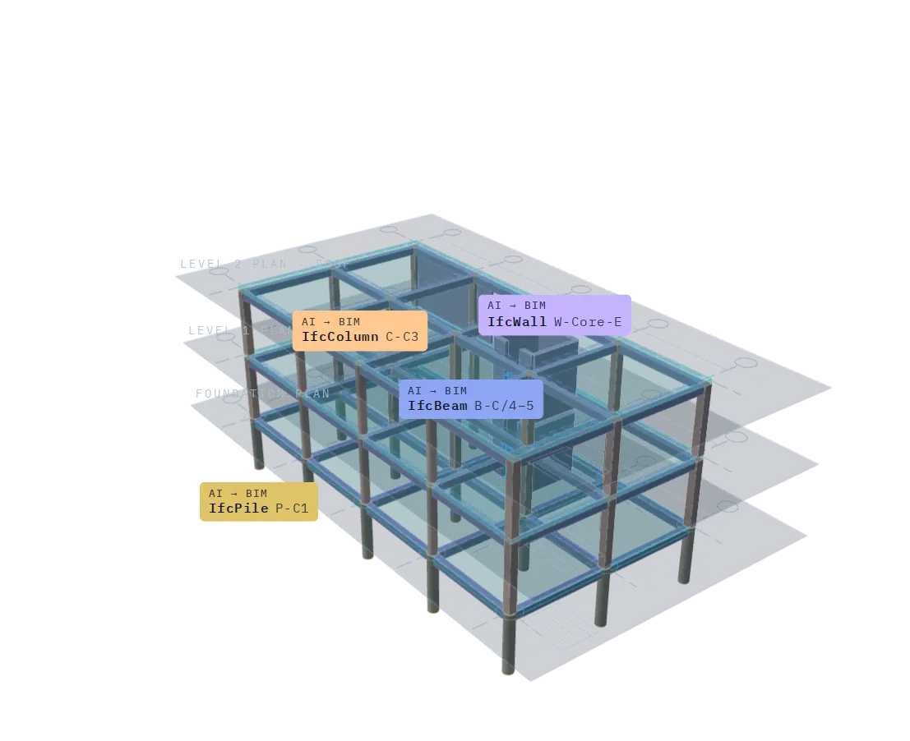
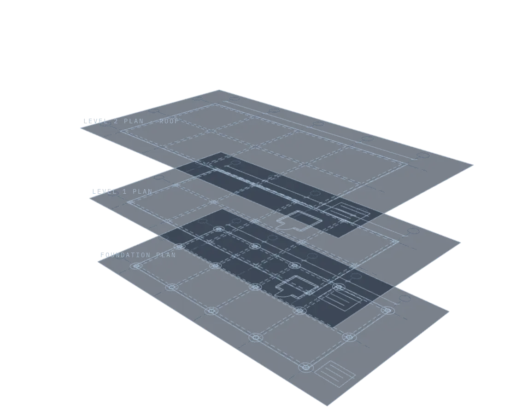
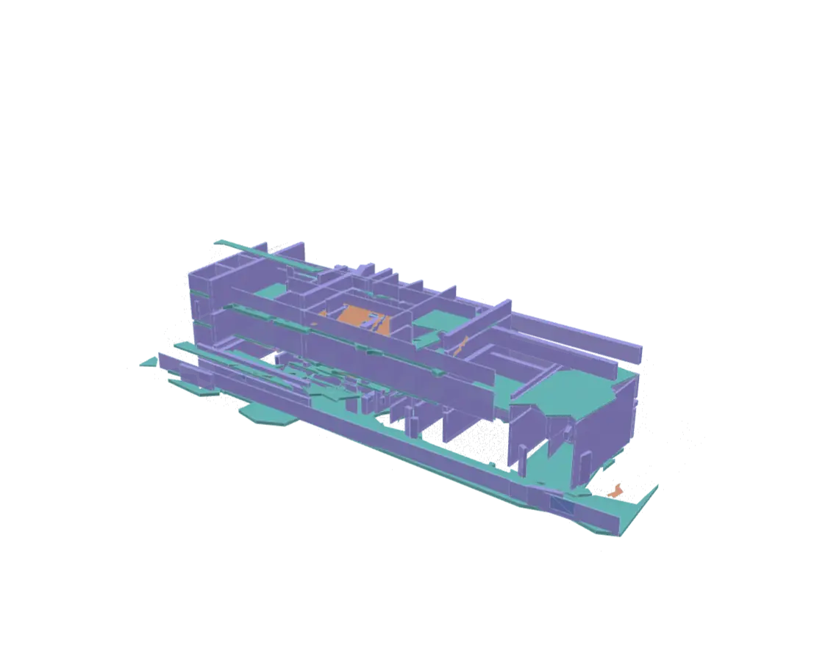
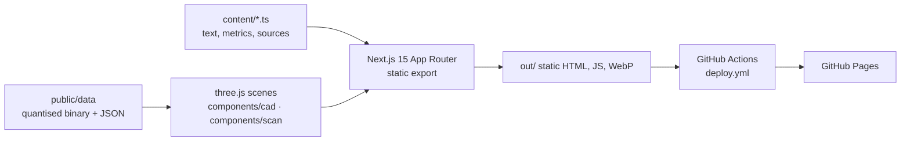

<p align="center"></p>

# Mohamed Ragab: portfolio

[](https://github.com/mohamedragab4554/mohamedragab4554.github.io/actions/workflows/deploy.yml)


**Live: [mohamedragab4554.github.io](https://mohamedragab4554.github.io/)**

This is the source for my professional portfolio: a structural engineer working in AI, computer vision, BIM and Scan-to-BIM. It's a static Next.js site with **WebGL visuals built from real project data**. Every metric on the site carries a source reference to the file it came from.

## Highlights

| | |
|---|---|
| **Hero: CAD-to-BIM on real data** | Three structural plans of a building from my model's **test split** (public BLD-ST data). My 8-class YOLOv8-seg model's **268 real detections** are shown with confidence scores, then extruded level by level into a 3D frame. Rejected detections, such as a "pile" on an upper floor, are shown and explained |
| **Scan-to-BIM on real data** | 120,000 points from the 250.5 M-point Kladno station scan, coloured by the element of my final IFC model they support. The IFC is revealed storey by storey inside the scan |
| **Six evidence-led case studies** | Challenge → input data → workflow → result → impact, with charts, data tables, limitations and sources |
| **Quality** | Lighthouse desktop 100 / 100 / 100 / 100 (performance, accessibility, best practices, SEO). No console errors. No horizontal overflow from 375 px up. WCAG AA contrast |

<table>
<tr>
<td width="50%"><br/><sub>Plans with the model's detections and confidence</sub></td>
<td width="50%"><br/><sub>Scan-to-BIM: IFC model inside the scan</sub></td>
</tr>
</table>

## Architecture



- **Content is data.** All text, metrics and evidence paths live in `content/`, and components render them. `lib/cite.ts` turns each metric's `source` into a readable citation.
- **3D stays light.** Plan textures are WebP. Detections are JSON. Points and meshes are int16-quantised binary: about 1 MB for the scan scene, and phones load 50k points instead of 120k. The scenes load only when near the viewport, pause off-screen, respect `prefers-reduced-motion`, and fall back to still images when WebGL is unavailable or the device is low-power.
- **No runtime third parties.** Fonts are self-hosted, with no analytics, trackers or external requests.

## Project structure

```
app/                     routes: home, /projects/[slug], /experience, /research, /about, 404
components/cad/          CAD-to-BIM WebGL scene (plans -> detections -> 3D build)
components/scan/         Scan-to-BIM WebGL scene (points -> segmentation -> IFC reveal)
components/charts/       SVG charts with tooltips and accessible data tables
content/                 profile, projects, experience, research, AI lifecycle (single source of truth)
public/data/             real data for the 3D scenes
public/images/           WebP assets (provenance: docs/ASSET_SOURCES.md)
scripts/                 asset preparation and CV build (scripts/cv/cv.html -> Mohamed_Ragab_CV.pdf)
.github/workflows/       deploy.yml: build + publish to GitHub Pages on every push to main
```

## Run locally

Requires Node.js 18.18+ (22 recommended).

```bash
npm ci
npm run dev          # http://localhost:3000
npm run typecheck    # tsc --noEmit
npm run build        # static export to ./out
npm start            # serve ./out
```

Windows, macOS and Linux all work the same way. On Windows, use PowerShell or Git Bash.

## Deploy

Deployment is automatic: `.github/workflows/deploy.yml` builds the site and publishes `out/` to GitHub Pages on every push to `main`. To run it by hand, open **Actions → Deploy portfolio to GitHub Pages → Run workflow**.

To host on **Vercel** or **Netlify** instead, import the repository and set build command `npm run build` and output directory `out`.

### Custom domain

1. On GitHub, open **Settings → Pages → Custom domain**, enter the domain and save. GitHub commits a `CNAME` file.
2. At your registrar, add DNS records:
   - **Apex domain:** four `A` records, to `185.199.108.153`, `185.199.109.153`, `185.199.110.153` and `185.199.111.153` (plus `AAAA` records `2606:50c0:8000::153` to `8003::153` if IPv6 is supported).
   - **`www`:** a `CNAME` record to `mohamedragab4554.github.io`.
3. When the DNS check passes, tick **Enforce HTTPS**. Paths are root-relative, so nothing else changes.

## Updating content

| File | Controls |
|---|---|
| `content/profile.ts` | Name, title, headline, contact links, proof metrics, capability pillars, and the switches `showEmployerNames` / `useIndustryPhotos` |
| `content/projects.ts` | Case studies: summary, what I did, workflow, tools, metrics (each with `source`), charts, gallery, limitations, code links |
| `content/story.ts` | Accent colours, input-data cards, before/after pairs, inference viewer, systems map, programme timeline |
| `content/experience.ts` · `research.ts` · `ai.ts` | Roles and skills · dissertation, education, certifications · AI lifecycle and digital-twin content |

Edit a value, commit, push: the site redeploys in about 2 minutes. Images should be WebP under about 1,600 px wide. `scripts/prepare_*.py` regenerate them from the originals, which are never modified.

## Accessibility and performance

- Semantic landmarks, a skip link, visible focus rings, and keyboard-operable sliders, tabs and viewer (Esc / ← / →).
- Every chart has a data table, and every image has alt text.
- Motion runs only when JavaScript is available **and** the visitor hasn't asked for reduced motion. Otherwise all content is static and fully visible.

## Related repositories

- [concrete-defect-detection-shm](https://github.com/mohamedragab4554/concrete-defect-detection-shm): YOLO-seg / U-Net / FPN defect models with field validation.
- [water-tank-crack-digital-twin](https://github.com/mohamedragab4554/water-tank-crack-digital-twin): crack width to Revit, Speckle and Power BI.

## Content and licence

The site's **code** may be read and reused for learning. The **content** (text, images, data, CV) describes my own work and isn't licensed for reuse. Third-party data shown on the site (BLD-ST plans, the Kladno benchmark scan) belongs to its publishers; see [docs/ASSET_SOURCES.md](docs/ASSET_SOURCES.md).
